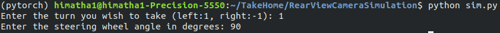

# RearViewCameraSimulation

## Rear view camera simulation with guidelines and object detection

### Dependencies:
* yaml
* numpy
* opencv
* pytorch
* ultralytics

### Assumptions:
* The world coordinate frame perfectly aligns with the camera frame.
* The camera using which the video has been captured doesn't have any radial or tangential distortion.

### File to run:
sim.py: This is the main file which performs the simulation by taking the following user inputs while runtime. The simulation is a linear change in the steering wheel from zero degrees to the user input angle in degrees.

### Details of Files:

* ##### params.yaml
    Before running the simulation ensure that the details provided in this file are correct and plausible.

* ##### parser.py
    This file consists of the helper functions to parse the config file and input video file.
    
* #### transform.py
    This files has the transformation funciton to transform from 3d coordinates to 2d image plane.

### Output:
The outut is the simulation window with the guidelines changing according to the steering wheel angle and object detections.

## Object detection:
* YOLOv8n model has been custom trained for object detection.
* For better accuracy in detection, bigger versions of YOLOv8 (YOLOv8s, YOLOv8m etc.) can similarly be trained.
* The dataset used for transfer learning is [Vehicles-OpenImages](https://public.roboflow.com/object-detection/vehicles-openimages).
* This dataset is highly imbalanced in terms of number of classes as below.

    

* Technically, further pre-processing, usage of focal loss while training, etc. would be recommended to address class imbalance issue.
* As YOLOv8 adopts ensemble learning strategy which would also address the class imbalance issue, no pre-processing has been done before training.

### Training
* Dowload the training dataset to the dataset folder.
* Start the training with the following command.
    > yolo detect train optimizer=AdamW cos_lr=True lr0=0.001 model="yolov8n.pt" data="dataset/data.yaml" epochs=100
* AdamW has been used as the optimizer for more stability and generalization while training.
* The learning rate has been kept low for transfer learning.
* The cosine learning rate has been enabled for better convergence, regularization, etc. properties.
* The training results are as shown below.

    

* After the training is done, update the weights path in the params.yaml file.
